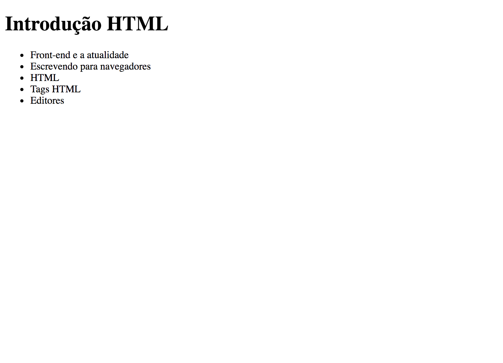

Front-end - Introdução a HTML
=============================

### Agenda
- Front-end e a atualidade
- Escrevendo para navegadores
- HTML
- Tags HTML
- Editores
- Exercício

### Front-end e a atualidade
Com o maior acesso à tecnologia pela população e a consequente popularização dos navegadores e similares a função front-end cresceu. Mas afinal como descrever o papel de uma pessoa com essa função?

Há não muito tempo atrás, saber um pouco de HTML e improvisar no CSS e no JS era o suficiente para ser front. Hoje em dia, o domínio dessa pessoa deve ser muito maior. Surgiram tópicos como automação de tarefas, performance, semântica e o foco está maior no JS e seus frameworks. 

### Escrevendo para navegadores ou similares
O navegador é um software que permite que usuários interajam com documentos HTML. Esses documentos foram escritos por programadores e estão armazenados em computadores chamados servidores. Os navegadores são os principais softwares utilizados atualmente. Existem também tecnologias por traz de frameworks como [Electron](http://electron.atom.io/) e [Ionic](https://ionicframework.com/) que possibilitam a exibição de documentos HTML "fora do navegador" em celulares, computadores, etc.

Mas afinal o que é HTML?

### HTML
Abreviação de HyperText Markup Language, que significa Linguagem de Marcação de Hipertexto.

Aqui um pouco da história da linguagem:


> Tim Berners-Lee (físico britânico) criou o HTML original [...]. Na época a linguagem não era uma especificação, mas uma coleção de ferramentas para resolver um problema de Tim: a comunicação e disseminação das pesquisas entre ele e seu grupo de colegas. Sua solução, combinada com a então emergente internet pública (que tornar-se-ia a Internet) ganhou atenção mundial. As primeiras versões do HTML foram definidas com regras sintáticas flexíveis, o que ajudou aqueles sem familiaridade com a publicação na Web. Através do tempo, a utilização de ferramentas para autoria de HTML aumentou, assim como a tendência em tornar a sintaxe cada vez mais rígida. Apesar disso, por questões históricas (retrocompatibilidade), os navegadores ainda hoje conseguem interpretar páginas web que estão longe de ser um código HTML válido.

Então, HTML é uma linguagem de marcação. Como essa marcação pode ser feita?

### Tags HTML
Documentos HTML são compostos por **tags**. Tags são palavras que o navegador conhece e cada uma delas tem uma funcionalidade específica. Atributos, valores e filhos (que podem ser outras tags ou texto). Os atributos modificam os resultados padrões dos elementos e os valores caracterizam essa mudança.

Um documento HTML básico válido precisa seguir a seguinte estrutura:

```
<!DOCTYPE html>
<html>
    <head>
        <title>Introdução HTML<</title>
        <meta charset="utf-8">
    </head>
    <body>

    </body>
</html>
```

A tag `body` tem como objetivo inserir elementos visuais na página. Alguns exemplos desses elementos são textos, imagens e tabelas.

A tag `head` tem como objetivo inserir elementos de configuração para o navegador. Elementos que não façam parte da página em si como encoding e título.

Dentre as muitas tags, vamos ver mais detalhes das referentes a título e lista.

##### Tags de título
Para indicar um texto de título devemos usar as tags de _heading_.

As tags de heading são tags de conteúdo e vão de `<h1>` a `<h6>`, seguindo a ordem de importância, sendo `<h1>` o título principal, o mais importante, e `<h6>` o título de menor importância.

Essa ordem de importância se traduz em efeito visual na página, assim `<h1>` tem maior tamanho de fonte e `<h6>` tem o menor tamanho de fonte. Além da diferença visual, existe também a diferença semântica de cada tag que é ponto crucial para _os motores de busca_, _leitores de tela_.

Exemplo:

```
<h1>Introdução a HTML</h1>
<h2>Navegadores</h2>
```


##### Tags de lista
Para indicar uma lista não ordenada devemos usar a tag de _unordered list_ (`<ul></ul>`) e para compor os itens da lista devemos utilizar a tag de _list item_ (`<li></li>`).

Exemplo:

```
<ul>
    <li>maçã</li>
    <li>banana</li>
    <li>laranja</li>
</ul>
```

### Editores
É possível escrever para web usando editores de texto simples como notepad no Windows ou Gedit no Unix mas existem editores próprios para isso que tornam nosso dia a dia mais produtivo.

Alguns exemplos são: [Atom](https://atom.io/), [Sublime Text](http://www.sublimetext.com/), [Brackets](http://brackets.io/).

Vale lembrar que a utilização dos "poderes" desses editores não substitui de forma alguma o conhecimento das tags e suas funcionalidades.

### Exercício
Criar a página `introducao.html` com a lista dos tópicos estudados hoje utilizando tag próprias para listas.

Ao final do exercício a aparência da sua página deve ser similar a imagem a seguir.



### Referências
- https://www.caelum.com.br/apostila-html-css-javascript/introducao-a-html-e-css
- https://pt.wikipedia.org/wiki/HTML
- https://pt.wikipedia.org/wiki/Navegador_web
- https://pt.wikipedia.org/wiki/Linguagem_de_programa%C3%A7%C3%A3o